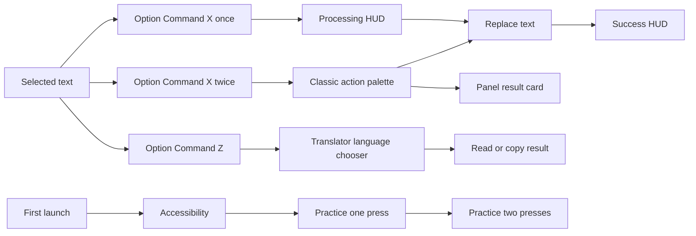

# Qwixit Design Blueprint

**Status:** normative product and motion specification  
**Platform:** macOS 14+, menu bar utility  
**Implementation model:** SwiftUI views hosted in AppKit windows and panels  
**Canvas unit:** 1 point at native macOS scale  
**Source of truth:** the current Qwixit implementation on `main`

This document is intended to be pasted into Claude Design or handed to a designer or engineer. Recreate the system precisely before proposing variations. Preserve the supplied brand assets and the current behavior of the classic action palette and dedicated translator.

---

## 1. Product character

Qwixit is a fast, keyboard first writing utility that lives beside selected text. It should feel like a small, alert cyber companion rather than a conventional AI chat product.

The visual character combines:

- pale paper like surfaces and near black ink;
- electric violet as the primary action color;
- cyan and magenta chromatic splits as the cyber signal;
- compact monospaced operational copy;
- rounded macOS geometry with thin borders;
- tiny expressive text faces that communicate state;
- motion that is brief, local, and tied to real activity.

### Design principles

1. **Selected text stays central.** Context panels sit beside the selection and avoid covering it.
2. **Keyboard use is visible and complete.** Every quick action can be reached with arrows, Tab, Return, Escape, or a number.
3. **Quick surfaces remain compact.** A toast confirms. A palette chooses. Peek reads. None becomes a dashboard.
4. **Faces guide instead of decorate.** Use one small contextual face, never a large mascot illustration.
5. **Cyber effects carry meaning.** Scans mean processing, green means replacement succeeded, magenta and cyan distinguish modes.
6. **No invented chrome.** Do not add explanatory labels, helper rows, floating badges, or persistent copy to quick actions.
7. **Mouse and keyboard are equal input paths.** Every visible button must click; every core flow must work without a mouse.

### Nonnegotiable product rules

- The main hotkey is **Option + Command + X**.
- One press fixes and replaces selected text.
- Two presses open the classic action palette.
- **Option + Command + Z** opens Peek.
- The classic action palette and the focused translator are intentionally separate surfaces. Preserve their distinct behavior.
- Do not display an interruptive **29/30** notification. Limit interruption happens only when usage reaches **30/30**.
- Onboarding requests Accessibility access first, then teaches the real hotkeys through direct interaction.
- Onboarding can advance by mouse click or Return. Never present a Continue control that only looks clickable.
- Loading uses the exact “Look around” face sequence defined in this document.

### Product flow map



---

## 2. Brand assets

Use the supplied assets. Do not redraw, typeset, trace, or approximate the logo.

| Asset | Use |
|---|---|
| `QwixitLockupLight` | Full wordmark on light surfaces |
| `QwixitLockupDark` | Full wordmark on dark surfaces |
| `QwixitMarkLight` | Small mark on light themed windows |
| `QwixitMarkDark` | Small mark on dark themed windows |
| `QwixitMarkInk` | Single color mark |
| `QwixitMarkWhite` | Mark on strong dark or color fills |
| `QwixitTower` / `QwixitTowerWhite` | Branded tower artwork where already specified |
| App icon set | macOS application icon at native sizes |

Logo and mark images use aspect fit. They must remain sharp at native Retina scale. Never render a logo bitmap larger than its intended asset resolution.

---

## 3. Color system

All semantic colors have explicit light and dark variants. Use sRGB values exactly.

| Token | Light | Dark | Role |
|---|---:|---:|---|
| `ink` | `#16131F` | `#F1EDFA` | Primary text, strong icons |
| `secondary` | `#6E6B7D` | `#B0ABBF` | Hints, metadata, inactive controls |
| `canvas` | `#F9F8FC` | `#0C0A12` | Main window background |
| `canvasRaised` | `#FDFCFF` | `#120F19` | Headers, footers, utility bands |
| `surface` | `#FFFFFF` | `#17141F` | Cards and panels |
| `surfaceHover` | `#F6F4FD` | `#251F30` | Hover, keycap, quiet selected areas |
| `line` | `#DFDAEC` | `#403750` | Borders and dividers |
| `violet` | `#6D28FF` | `#9661FF` | Primary actions, processing, active focus |
| `magenta` | `#FF2D9B` | `#FF4FAD` | Panel output and chromatic split |
| `cyan` | `#00ABC7` | `#26C9E3` | Translation, cloud state, chromatic split |
| `success` | `#149145` | `#45C770` | Allowed and completed states |
| `terminalGreen` | `#149E4A` | `#47E67D` | Compact replacement success HUD |
| `warning` | `#D17308` | `#FAA629` | Missing access and caution |
| `danger` | `#E6293D` | `#FF5E6E` | Failure and destructive actions |
| `receipt` | `#F3F1F7` | `#1F1A27` | Quiet receipt or transcript surface |

### Color grammar

- Violet is the default interactive accent.
- Cyan owns translation and network/cloud cues.
- Magenta owns summary and panel style output.
- Green is reserved for completed, allowed, or replaced states.
- Warning and danger appear only when the user needs to act or an action failed.
- Cyan and magenta may appear together only for the chromatic face split, scan line, or processing sweep.
- Strong accent backgrounds use white foreground text.

### Theme behavior

The app has an explicit Light/Dark preference. It sets both the SwiftUI color scheme and the underlying AppKit window appearance. Do not derive the app theme from a translucent system material.

---

## 4. Typography

### Families

1. **Interface sans:** macOS system font.
2. **Operational mono:** macOS system monospaced font.
3. **Faces:** `JetBrains Mono ExtraBold`. Fall back to system monospaced Heavy.
4. **Large onboarding display:** system Rounded, Bold or Black.

### Type scale

| Style | Specification | Use |
|---|---|---|
| Display | 30 pt, Black, Rounded, tracking `-0.8` | Onboarding headline |
| Demo text | 24 pt, Bold, Rounded | Selected onboarding sample |
| Card title | 16 pt, Bold, Sans | Access and limit cards |
| Reading body | 11.5 pt, Medium, line spacing `2.5` | Peek translation content |
| Compact body | 13 pt, Regular or Semibold | Result cards, notices |
| Control title | 12 pt, Bold | Settings rows and buttons |
| Operational title | 11 pt, Bold Mono | HUD and compact modes |
| Control mono | 10 pt, Bold Mono | Actions, key hints, context |
| Label | 9 pt, Bold Mono, tracking `0.35` | Section labels and metadata |
| Micro status | 8 pt, Bold Mono, tracking `0.8–1.1` | HUD badges and detail |

Use uppercase only for operational signals such as `PROCESSING`, `READY`, `TEXT REPLACED`, `AI`, `OK`, or `ERR`. Use sentence case for normal settings and explanations.

---

## 5. Geometry, spacing, and elevation

### Spacing rhythm

Use a 2 point base rhythm. Common values are `2, 4, 6, 8, 10, 12, 14, 16, 18, 24`.

### Corners

| Element | Radius |
|---|---:|
| Main context panel | 14 |
| Onboarding palette | 17 |
| Onboarding selection card | 16 |
| Standard card | 12 |
| Processing HUD | 11 |
| Compact control/button | 8 |
| Small chip | 5–7 |
| Capsule choice | Full capsule |

Rounded rectangles use continuous corners where available.

### Borders

- Standard panel: 1 pt `line`.
- Selected/focused control: 1 pt accent at 55–75% opacity.
- Onboarding sample card: 1.5 pt `line`.
- Context accent rail: 2 × 24 pt capsule, inset 1 pt from the left edge.
- Mode/action accent: 3 × 12–18 pt rounded bar.

### Shadows

- Standard card: violet at 8% opacity, blur 12, y offset 5.
- Processing HUD: violet at 12% light or 20% dark, blur 16, y offset 6.
- Use AppKit panel shadow for floating windows. Avoid stacking additional heavy shadows.

### Standard surface recipe

```
fill: surface
corner radius: 14
border: 1 pt line
optional left accent: 2 × 24 capsule
```

---

## 6. Face system

Faces are text, always monospaced, kept on one line, and usually bracketed. They communicate current state and provide personality without adding a separate mascot panel.

| State | Face | Typical use |
|---|---|---|
| Hello | `[ ^_^ ]` | Ready, friendly neutral |
| Boot | `[ o_o ]` | First launch and permission |
| Ready | `[ ^_- ]` | Success and completed action |
| Pay | `[ ^o^ ]` | Usage limit and upgrade |
| Broke | `[ $_00_$ ]` | Out of tokens |
| Empty | `[ x_x ]` | 30/30 used |
| Upsell | `[ ¬_¬ ]` | Unlimited plan |
| Lost | `[ ?_? ]` | No network signal |
| Retry | `[ @_@ ]` | Reconnecting or retrying |
| Idle | `[ #_# ]` | Offline waiting |
| Scanning | animated, below | Active request |

### Face sizing

- Processing HUD: 13 pt.
- Menu and small status: 12 pt.
- Peek inline states: 12–15 pt.
- Upgrade card: 14–16 pt.
- Onboarding guide: 12 pt inside a 58 × 36 container.
- Never enlarge faces into hero artwork. The brackets should remain crisp and the face should not pixelate.

### Chromatic split

At 13 pt and above, render cyan and magenta copies behind the main glyph:

- cyan x offset: `-1.5 × size / 18`;
- magenta x offset: `+1.5 × size / 18`;
- main glyph remains centered in `ink` or the specified foreground color.

Below 13 pt, show only the primary glyph.

### Normal blink

- Begin open.
- Remain open for 4030 ms.
- Show the closed face for 170 ms.
- Repeat.
- Optional stagger between multiple faces: `stagger index × 1130 ms`.
- Reduced Motion: remain open and static.

### Loading face: “Look around”

This is the only scanning sequence. Change the face text only; keep its container, label, colors, and layout fixed.

```text
[ ¬_¬ ]
[ ¬_¬ ]
[ ¬_¬ ]
[ •_• ]
[ ¬_¬ ]
[ ¬_¬ ]
[ ¬_¬ ]
[ ¬‿¬ ]
```

- Frame duration: **320 ms**.
- Loop duration: approximately **2.56 seconds**.
- Start on `[ ¬_¬ ]` to avoid a visual jump.
- Preserve every space and the fixed seven character width.
- Use a monospaced font so `_` and `‿` occupy the same width.
- Reduced Motion: static `[ ¬_¬ ]`.
- Stop and dispose of the timer/task as soon as the request finishes or the face changes.

### Brand mark scan

When the small logo mark explicitly represents processing:

- overlay a 1 pt horizontal gradient line;
- gradient: clear → cyan 90% → magenta 80% → clear;
- width: `68%` of mark size;
- y travel: `-31%` to `+31%` of mark size;
- duration: 720 ms, linear, continuous loop;
- blend mode: additive/lighten;
- Reduced Motion: keep the mark static.

---

## 7. Motion system

Motion must explain state, input, or spatial continuity. Never animate the entire interface continuously.

| Motion | Timing | Curve | Behavior |
|---|---:|---|---|
| Processing label glyph wave | 560 ms loop | quadratic ease in/out | Cyan/magenta energy crosses characters, then holds for final 25% |
| Processing progress trace | 460 ms loop | linear | 42 pt light trace crosses a 100 × 2 track |
| HUD border sweep | 640 ms loop | linear | 68 × 1 highlight travels from x `-68` to `224` |
| Success outline pulse | 720 ms | ease out | Scale `1 → 1.18`, opacity `1 → 0` |
| HUD phase change | 130 ms | snappy | Insert at 97% scale; remove toward 101.5% |
| Feedback panel entrance | 80 ms | AppKit default | Alpha `0 → 1` |
| Palette entrance | 140 ms | AppKit default | Alpha `0 → 1` |
| Peek entrance | 150 ms | AppKit default | Alpha `0 → 1` |
| Peek resize | 180 ms | ease out | Keep top edge fixed while height changes |
| Onboarding state change | 240 ms | snappy | Local opacity and 94% scale transitions |
| Onboarding key response | 160 ms | snappy | Key press/tap state |
| Onboarding typed result | 22 ms per 2 characters | linear | Begins after 900 ms processing |
| Face blink | 4030 + 170 ms | stepped | Open pause, brief shut frame |
| Loading face | 320 ms/frame | stepped | Eight exact frames |

### Processing word effect

The word `PROCESSING` uses a character wave:

- 60 Hz timeline;
- 560 ms cycle;
- movement completes during the first 75% of the cycle;
- wave energy radius: 2.35 characters;
- cyan and magenta copies shift up to 1.8 pt left/right;
- glyph lift is up to 2.3 pt before the wave and 1.1 pt after it;
- maximum y axis rotation: 34° with perspective 0.48;
- static fallback: ordinary 11 pt Bold Mono, tracking 0.8.

### Reduced Motion

When macOS Reduce Motion is on, or when the app’s animation preference is off where supplied:

- scanning and blinking faces become static;
- processing word becomes static;
- progress trace and border sweep do not travel;
- success pulse is removed;
- state transitions do not scale or move;
- panel resize is immediate;
- panel entrances may use a short 80 ms opacity fade only;
- all controls, status changes, and completion messages remain available.

---

## 8. Context panel behavior

Quick panels are borderless, nonactivating AppKit panels with transparent window backgrounds, native shadows, and SwiftUI content.

### Placement

- Screen edge inset: 12 pt.
- Gap from selected text: 14 pt.
- Prefer the right side of selection when it fits.
- Otherwise use the left side.
- If neither fits, dock to the farther visible screen edge based on selection center.
- Vertical connection point is `min(panel height / 2, 42)` from the panel top relationship.
- Clamp the entire panel to the visible frame.
- Use mouse location only when Accessibility selection bounds are unavailable.

### Window behavior

- Join all Spaces and appear over full screen applications.
- Quick panels do not become main application windows.
- Click outside closes an unpinned palette or Peek panel.
- Escape closes the current layer; where a nested step exists it goes back first.
- Restore focus to the originating application before changing selected text.
- Never repeatedly recreate/show a visible panel in response to its own state updates. Resize or replace content in place to prevent blinking.

---

## 9. Primary feedback HUD

The one press fix flow uses a compact processing/success/error HUD beside the selected text.

### Window and box

- Window: **236 × 58**.
- Internal status box: **224 × 46** with 6 pt outer inset.
- Corner radius: 11.
- Horizontal padding: 12.
- Main HStack gap: 10.
- Face slot: 59 × 29; outline: 57 × 27, radius 8.
- Left accent: 2 × 24 with 5 pt glow.

### Surface

- Light: `surface` at 98%.
- Dark: `#0E0C16` at 96%.
- Add a diagonal wash: violet at 8% light/16% dark → clear → cyan at 5% light/8% dark.
- Border: `line` in light mode, white at 12% in dark mode.
- Apply the processing shadow defined in the elevation section.

### Processing state

- Face: animated scanning face at 13 pt.
- Headline: cyan `>` plus animated `PROCESSING`.
- Badge: `AI` in violet.
- Progress track: 100 × 2, base `line`, 42 pt violet/magenta/cyan moving trace.
- Border sweep runs while processing.

### Success state

- Face: `[ ^_- ]`.
- Headline: `READY` in `terminalGreen`, tracking 1.45.
- Detail: 14 pt green rule + `TEXT REPLACED` in 8 pt mono.
- Badge: `OK`.
- Play one outline pulse and one visible border sweep treatment.
- Default one press success duration: 1.25 seconds.
- Success invoked from the action palette may remain for 2.8 seconds.

### Error state

- Face: `[ @_@ ]`.
- Tone: danger.
- Badge: `ERR`.
- Detail: `TEXT UNCHANGED`.
- Choose the headline from the cause: `NOT REPLACED`, `EMPTY REPLY`, `SERVICE ERROR`, or `FAILED`.
- Typical duration: 4 seconds.

### Other compact notices

Permission, no selection, subscription sync, and offline states use a standard compact notice:

- HStack gap 11, horizontal padding 13, vertical padding 11;
- panel radius 13 with contextual 2 × 24 accent;
- icon tile 32 × 32, radius 9;
- title 13 Semibold; detail 10.5 Regular;
- window sizes: no selection 306 × 82, permission/subscription/offline 326 × 86.

No selection hides after 2.4 seconds. Permission and ordinary errors hide after 4 seconds. Offline and limit states may remain until explicitly dismissed or superseded in the one press flow.

### Limit card

- Window: **374 × 158**.
- Face: pay, 16 pt, violet.
- Title: 16 Bold.
- Body: 11 pt.
- Content padding: 16.
- Panel radius: 14 with violet left accent.
- Primary upgrade button uses the standard violet button.
- Copy communicates that 30 free actions are used. There is no 29/30 interruption.

---

## 10. Classic action palette: double press X

This surface is intentionally the compact classic version.

### Window

- Size: **432 × 260**.
- Panel radius: 14.
- Entrance: 140 ms alpha fade; 80 ms with Reduce Motion.
- Header: 50 pt high, `canvasRaised`, bottom divider.
- Footer: 38 pt high, `canvasRaised`.
- List padding: 12 horizontal, 10 vertical; maximum content height 380.

### Header

- Qwixit mark: 27 pt in a 28 pt slot.
- Search/instruction field: 13 pt Bold Mono.
- Placeholder: `Action or instruction…`.
- Optional context label: 9 pt Bold Mono, tracking 1.5.
- No large face, explanatory paragraph, or redundant shortcut legend.

### Action rows

- Standard row height: 36.
- Translation row height: 42.
- Horizontal row padding: 9.
- Accent bar: 3 × 16.
- Action title: 12 pt Bold Mono.
- Hint: 11 pt Mono.
- Mode label: 9 pt Bold Mono.
- Selected fill: accent at 13%.
- Selected border: accent at 72%.
- Selected radius: 8.

### Actions

1. **Translate** — choose Ukrainian or English; cyan accent; replaces selection.
2. **Slack style** — clear, concise, human; success green accent; replaces selection.
3. **Make formal** — polished professional tone; success green accent; replaces selection.

### Refinement state

If an action asks quick questions, keep them inside the same panel. Focused question fill is violet at 6%. Answer chips are 24 pt high, radius 6, with the selected answer at 16% accent fill and 72% border.

### Keyboard map

| Key | Action |
|---|---|
| Up / Down | Move selection |
| Tab / Shift Tab | Move forward/back |
| Return | Run selected action |
| 1–9 | Run corresponding visible action when query is empty |
| Escape | Back one layer, then close |
| Left | Back when available |
| Command Z | Undo the latest text replacement |
| Left / Right in refinement | Change answer |

Mouse clicking a row performs the same action as Return. Clicking outside closes the palette.

---

## 11. Translator: Option + Command + Z

Option + Command + Z is a dedicated read-only translator. It never replaces the selected text. Its only jobs are choosing a language, presenting a highly readable translation, pinning it, and copying it. Summary does not live in this flow.

### Window sizes

| State | Size |
|---|---:|
| Initial chooser | 440 × 250 |
| Loading or loaded | 440 × 360 |
| Pinned | 440 × 560 |
| Limit | 420 × 220 |
| Subscription activation | 420 × 190 |
| Failure | 420 × 220 |

- Entrance: 150 ms alpha fade; 80 ms with Reduce Motion.
- State resize: 180 ms ease out with the top edge fixed.
- Pinned position: 16 pt from right edge and 56 pt from top visible edge.
- Unpinned Peek closes on outside click. Pinned Peek remains open and is movable by the window background.

### Header

- Height: 48.
- Qwixit mark: 20 × 20.
- Awaiting choice title: `Translate to…`, 12 pt Semibold Sans.
- Result header: source code, arrow, then `UA PL DE EN` as compact text buttons. The active target is Black Mono; other targets use secondary text.
- Close control: `×`, 17 pt.

### Initial chooser

- Use a 2 × 2 grid with 8 pt gaps and 12 pt outer padding.
- Languages, in order: Українська, Polski, Deutsch, English.
- Language card: 62 pt high, radius 10, horizontal padding 12.
- Native language name: 13 pt Bold Sans.
- English description: 10 pt Regular Sans. The remembered target adds `· last used`.
- Numeric keycap: 24 × 24, radius 6, 9 pt Bold Mono.
- Selected card: violet fill at 7% and 1.5 pt violet border.
- Footer: 40 pt. Left shows source word count. Right shows `1–4 or ↵ to translate` and `Esc`.
- Clicking a card or pressing 1–4 starts translation immediately.

### Translation result

- There is no secondary control strip; the result begins directly below the header.
- Translation body: 11.5 pt Medium Sans with 2.5 pt line spacing.
- Body padding: 14 horizontal and 12 vertical.
- Loaded body maximum height: 250 unpinned, 500 pinned.

### Markdown reading format

Translation results use a compact Markdown renderer:

- paragraph gap: 8 pt;
- headings: 14.5 / 13.5 / 12.5 pt Bold for levels 1 / 2 / 3+;
- unordered list marker: a quiet en dash;
- numbered list marker: 11.5 pt Bold Mono in the mode color;
- quotes: 2 pt mode-color rail and secondary text;
- fenced code: minimum 10.5 pt Medium Mono on the `receipt` surface, radius 8, 10 × 8 pt padding, horizontal scrolling;
- inline Markdown supports emphasis, strong text, links, and code spans;
- all rendered result text remains selectable.

The translation request returns logical semantic blocks rather than one item per sentence. The first block always supplies a concise 3–7 word title in the target language. For technical input longer than 45 words, produce 3–6 ordered blocks of one or two sentences without omitting content. Later blocks may have short bold lead-ins such as Context, Problem, Cause, Impact, Behavior, or Fix when that role is clear. Preserve paragraphs, headings, lists, quotes, fenced code, existing Markdown, file names, line references, commands, and code identifiers. Do not add commentary or repeat information.

### Loading and state content

- Loading label: `Qwixing…`, 10 pt Bold Mono, tracking 0.35.
- Skeleton: three 9 pt bars at 92%, 78%, and 85% width, 13 pt vertical gap, radius 3.
- Retry uses `[ @_@ ]` at 13 pt.
- Limit uses `[ ^o^ ]` at 14 pt and a compact upgrade button.
- Offline uses `[ ?_? ]` or `[ #_# ]` with concise unchanged text.

### Footer

- Height: 34, `canvasRaised`, horizontal padding 14.
- Left: source word count and `Esc`.
- Right: Pin/Unpin and violet `Copy ⌘C` button.
- Button height: 25, radius 5, text 9 pt Bold Mono.

### Keyboard map

| Context | Key | Action |
|---|---|---|
| Chooser | Arrow keys or Tab | Move choice |
| Chooser | Return | Submit choice |
| Chooser | 1–4 | Translate to numbered language |
| Loaded | 1–4 | Translate to another language |
| Any | P | Pin or unpin |
| Loaded | Command C | Copy result |
| Any | Escape | Close |

All language, Pin, Copy, and Close controls are clickable.

---

## 12. Onboarding

Onboarding is a real interactive rehearsal, not a slideshow.

### Window and structure

- Window: **820 × 620**.
- Standard titled, closable macOS window with transparent title bar.
- Header: 62 pt, horizontal padding 24.
- Qwixit lockup: 90 × 30.
- Main title: 30 pt Black Rounded.
- Content maximum width: 660.
- Footer: 58 pt, horizontal padding 28, top divider.
- Steps: **Access → Press once → Tap twice**.

### Step 1: Accessibility access

- Ask for access immediately.
- Main permission card: maximum width 560, radius 15, horizontal padding 16.
- Icon tile: 42 × 42, radius 12.
- Title: 16 Bold.
- Settings path: 10 pt Semibold Mono.
- Action pill: 30 pt high, horizontal padding 12, radius 8.
- Clicking the card or its action opens the correct Accessibility pane and begins permission polling.
- Return performs the same action.
- Poll permission every 500 ms for up to 15 seconds.
- When permission becomes granted, change the same card to `Continue to practice`, show `ACCESS GRANTED · PRESS ENTER TO CONTINUE`, and allow either a click or Return to advance.

Guide copy must clearly say `PRESS ENTER TO CONTINUE` whenever Return advances the flow.

### Step 2: Press once

- Headline: `Fix it with one shortcut.`
- Selected sample: `helo i thnik this sentnce sound wierd`.
- User must press the real Option + Command + X shortcut.
- Show the actual processing HUD, then type the corrected result:
  `Hello, I think this sentence sounds weird.`
- After completion, the visible Continue button and Return both advance.

### Step 3: Tap twice

- Selected sample: `yo can u send me the file asap pls`.
- User presses Option + Command + X twice.
- Double press timeout: 900 ms in onboarding rehearsal.
- Open the onboarding palette 120 ms after the second press.
- The palette is **520 × 244**, radius 17, header 45, footer 34.
- Choices: Ukrainian, Polish, Slack, Formal.
- Arrow keys move selection; Return chooses; 1–4 chooses directly; Escape closes.
- Show processing and type the chosen result.
- After completion, Continue or Return finishes onboarding.

### Onboarding sample card

- Height: 92.
- Radius: 16.
- Border: 1.5 pt `line`.
- Shadow: violet 7%, blur 14, y 6.
- Demo text: 24 pt Bold Rounded.
- Text selection highlight: pale violet.
- Processing accent caret/rail: violet, 3 × 27.

### Guide face

- Face size: 12.
- Container: 58 × 36, radius 10, violet fill at 9%.
- Guide copy: 12 pt Bold Mono inside a white/surface bubble, radius 11, horizontal padding 13, vertical padding 10.
- Keep the face small and context dependent.

### Hotkey rehearsal animation

The animated key diagram demonstrates the expected rhythm while waiting for real input:

1. idle for 850 ms;
2. Option down for 240 ms;
3. Command down for 240 ms;
4. X down for 150 ms;
5. on Tap twice, return to modifier state for 160 ms and press X again for 150 ms;
6. reset and wait 850 ms before repeating.

Key press state changes use a 160 ms snappy transition. Stop the demonstration when real user input starts.

### Result rehearsal timing

- Processing state: 900 ms.
- Type two characters every 22 ms.
- After typing completes, switch to complete state and reveal the continuation path.
- State transitions: 240 ms snappy opacity and 94% scale.

---

## 13. Settings window

### Window

- Production: **500 × 624**.
- Debug: **500 × 704**.
- Transparent full size title bar, movable by background.
- Canvas background, explicit theme.

### Layout

- Header: 72 pt, horizontal padding 18, `canvasRaised`.
- Lockup: 104 × 28.
- Subtitle: 10 pt Sans.
- Scroll content padding: 18; section gap: 14.
- Footer: 54 pt, horizontal padding 18, `canvasRaised`.

### Sections

- Appearance.
- Hot keys.
- Access.
- Plan / billing.
- Developer tools in debug builds only.

Each section uses a 9 pt Bold Mono label and a standard card. Setting rows have a minimum height of 54 and horizontal padding 12. Icon tile is 30 × 30, radius 8. Row title is 12 Bold; detail is 9.5 Regular with at most two lines.

### Standard controls

- Primary button: 32 pt high, radius 8, 15 pt horizontal padding, 12 Bold white text, vertical violet gradient from `violet` to `#5716E0`, white border at 18%.
- Pressed primary state: opacity 82%, scale 98.5%.
- Subtle button: 30 pt high, radius 8, 12 pt horizontal padding, surface fill and line border.
- Shortcut badge: 25 pt high, radius 7, 7 pt horizontal padding, 10.5 Bold Mono.
- Keycap: minimum 26 × 25, radius 6, bottom key edge line.
- Access badge: capsule, 28 pt high or 24 pt compact, success/warning tone.

---

## 14. Menu bar popover

- Width: **318**.
- Background: `canvas`.
- Utility bar: 28 pt, horizontal padding 12, version left and cyan `Cloud` right.
- Brand header: 68 pt, horizontal padding 14, lockup 108 × 34.
- Show the main shortcut badge and compact access badge.
- Optional billing row: 34 pt; 44 pt when an upgrade button is visible.
- Bottom action row: 43 pt with three equal actions: Settings, Onboarding, Quit.
- Use 1 pt vertical dividers of height 24.
- Quit uses `danger`; other actions use `secondary`.

Usage may be shown here as persistent plan information. It must not generate a separate 29/30 notification. At 30/30, show the upgrade action.

---

## 15. Panel result card

Actions configured for panel output use a larger result card.

- Window: **480 × 360**.
- Standard 14 pt panel surface.
- Header: 16 pt padding, 10 pt Bold Mono.
- Action title uses magenta diamond and action name.
- State copy says `Text unchanged` because panel mode does not replace the source.
- Result: selectable 13 pt body with 5 pt line spacing and 18 pt padding.
- Footer input area: 14 pt padding.
- Follow up field placeholder: `Ask about this text…`.
- Controls: Copy and magenta Insert below.
- Loading uses a small magenta progress control and `Qwixing…`.

---

## 16. Content and copy rules

- Write short, direct, calm sentences.
- Operational UI may be terse: `READY`, `AI`, `OK`, `ERR`, `Esc`, `Copy ⌘C`.
- Explanations use normal sentence case.
- State what happened to the user’s text: `TEXT REPLACED` or `TEXT UNCHANGED`.
- Avoid generic AI language such as “magic,” “assistant is thinking,” or long model explanations.
- Keep technical implementation details out of product copy.
- Error titles explain the outcome; the detail explains the recovery action.
- Never place design system annotations such as `2A`, internal component names, or redline labels in production UI.

---

## 17. Accessibility and input

- Every icon-only control has an accessibility label.
- Face text exposes a useful state label such as `Scanning` rather than each animation frame.
- Combine multi-part badges into one accessibility element.
- Text remains legible in both themes and does not rely on accent alone.
- Interactive targets remain clickable across their full visible bounds.
- Visible Continue controls are real buttons.
- Return and keypad Enter share behavior.
- Escape consistently dismisses or goes back.
- Preserve text selection and VoiceOver access in result bodies.
- Respect macOS Reduce Motion throughout.
- Do not steal main-window status from the user’s active app for transient operations.

---

## 18. State and acceptance checklist

### Visual

- [ ] Correct supplied logo asset is used for the active theme.
- [ ] All colors come from semantic tokens.
- [ ] Panels use the correct fixed dimensions and radii.
- [ ] Faces use JetBrains Mono ExtraBold or the heavy monospaced fallback.
- [ ] Faces stay small and sharp; spacing inside brackets never shifts.
- [ ] Cyan/magenta splits appear only in approved cyber effects.
- [ ] No internal design labels are visible.

### Interaction

- [ ] One press fixes selected text and shows the processing HUD.
- [ ] Two presses open the 432 × 260 classic action palette.
- [ ] Option + Command + Z opens the four-language translator chooser.
- [ ] Arrow keys, Tab, Return, Escape, and number keys work as specified.
- [ ] Every visible action also responds to a mouse click.
- [ ] Context panels do not cover the selected text when an adjacent position exists.
- [ ] Panels do not blink, reopen, or loop their entrance animation during state updates.

### Onboarding

- [ ] Accessibility access is requested in the first step.
- [ ] The Allow control opens the correct System Settings pane.
- [ ] Permission polling updates the UI and unlocks the next step.
- [ ] `PRESS ENTER TO CONTINUE` appears when Return can advance.
- [ ] Continue buttons click and Return produces the same result.
- [ ] The user performs the real one press and two press shortcuts.

### Motion

- [ ] Loading uses the exact eight frame 320 ms sequence.
- [ ] The loading task stops immediately on completion.
- [ ] HUD trace, border sweep, label wave, and success pulse match exact timings.
- [ ] Panel entrance animation plays once per opening.
- [ ] Reduce Motion produces a complete, static experience.

### Usage

- [ ] No interruptive 29/30 toast exists.
- [ ] 30/30 displays the limit card and upgrade action.
- [ ] Persistent plan status may report ordinary usage inside Settings or the menu bar.

---

## 19. Claude Design handoff prompt

Paste the following together with this document:

> Design Qwixit for macOS from the attached normative blueprint. Reproduce its tokens, fixed window sizes, keyboard behavior, state hierarchy, face system, and motion timings exactly. Use the supplied Qwixit assets without redrawing them. Treat the one press feedback HUD, classic double press action palette, dedicated Option-Command-Z translator, onboarding, Settings, menu bar popover, and result card as one coherent system. Keep quick actions compact and keyboard first. Do not add helper labels, generic AI chat patterns, large mascot art, glassmorphism, new gradients, new actions, or internal design annotations. Provide light and dark variants, all loading/success/error/limit states, and static Reduced Motion variants. Show interaction specifications for mouse, arrows, Tab, Return, Escape, and number keys. Validate every screen against the acceptance checklist before presenting it.

---

## 20. Implementation references

These files are the final authority if a numeric or behavioral ambiguity remains:

- `Qwixit/Core/DesignSystem/DesignSystem.swift`
- `Qwixit/Features/QuickImprove/Presentation/FeedbackPill.swift`
- `Qwixit/Features/QuickImprove/Presentation/FeedbackWindowController.swift`
- `Qwixit/Features/Palette/Presentation/PaletteView.swift`
- `Qwixit/Features/Palette/Presentation/PalettePanelController.swift`
- `Qwixit/Features/Palette/Presentation/ResultHUDController.swift`
- `Qwixit/Features/Palette/Presentation/ResultCardController.swift`
- `Qwixit/Features/Peek/Presentation/PeekView.swift`
- `Qwixit/Features/Peek/Presentation/PeekPanelController.swift`
- `Qwixit/Features/Settings/Presentation/OnboardingView.swift`
- `Qwixit/Features/Settings/Presentation/SettingsView.swift`
- `Qwixit/Features/Settings/Presentation/MenuBarView.swift`
- `Qwixit/App/QwixitApp.swift`
